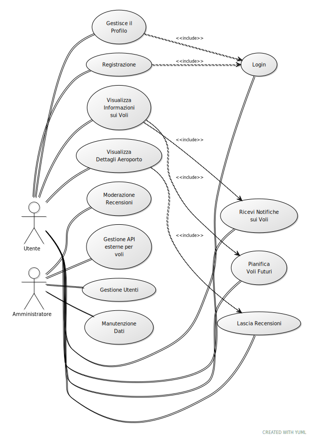

# WorldFlightTracker

## Titolo
**WorldFlightTracker**

## Descrizione
WorldFlightTracker è una piattaforma che permette di monitorare informazioni sui voli in tutti gli aeroporti del mondo, fornendo aggiornamenti in tempo reale su gate, orari, ritardi e durata del tragitto. La piattaforma offre anche informazioni dettagliate sui servizi aeroportuali e include recensioni verificate dai viaggiatori. Grazie a un'interfaccia intuitiva, è accessibile da qualsiasi dispositivo, mobile o desktop. Inoltre, consente agli utenti di condividere recensioni e esperienze, creando una community di viaggiatori con feedback reali.

## Slogan
**"Le informazioni di volo che desideri, sempre a portata di mano"**

## Target
Viaggiatori e passeggeri occasionali che desiderano monitorare e ricevere informazioni in tempo reale sui propri voli.

## Problema
Avere tutte le informazioni sul proprio volo in un'unica app, con aggiornamenti in tempo reale su gate, ritardi, cancellazioni e altri dettagli essenziali, senza dover consultare diverse fonti o app.

## Competitor
Alcune delle app concorrenti includono:
- Flighty
- App in the Air
- FlightView
- Flight Board
- Flight Aware
- Flight Stats
- Track my Flight Now
- The Flight Tracker
- Flightradar24
- Flight Tracker Radar
- Plane Finder
- Skyscanner
- RadarBox
- Flight Status
- Flight Tracker Live
- FlightHero
- JetRadar
- Airline Flight Status Tracker

## Tecnologie
WorldFlightTracker utilizza diverse tecnologie per garantire l’efficienza e la reattività dell’applicazione:
- **Backend**: Node.js con Express per la gestione delle API
- **Database**: SQLite3 per la gestione dei dati su voli e utenti
- **Frontend**: Vue.js per un’interfaccia utente intuitiva e reattiva
- **Notifiche in tempo reale**: Servizi di notifica per aggiornamenti su gate, ritardi, cancellazioni
- **Integrazione API di terze parti**: API esterne per ottenere dati aggiornati sui voli


---

## Requisiti Funzionali

1. **Database degli aeroporti**:
   - Database contenente descrizioni degli aeroporti, servizi disponibili, foto e valutazioni utenti.

2. **Database degli utenti**:
   - Gestione dei dati degli utenti registrati con possibilità di eliminare account.

3. **Registrazione degli utenti**:
   - Funzionalità di registrazione e gestione del profilo utente con notifiche sui voli.

4. **Funzionalità di ricerca**:
   - Ricerca avanzata per trovare aeroporti, orari dei voli e dettagli pertinenti.

5. **Notifiche sugli aggiornamenti dei voli**:
   - Sistema di notifiche in tempo reale per ritardi, cancellazioni e aggiornamenti di gate.

6. **Integrazione API esterne per informazioni sui voli**:
   - Dati aggiornati sui voli grazie a API esterne.

7. **Pianificazione voli futuri**:
   - Opzioni per pianificare voli, impostare promemoria e ricevere aggiornamenti.

8. **Esposizione API pubblica**:
   - API pubblica documentata per l’accesso ai dati su aeroporti e voli.

9. **Architettura client-server**:
   - Gestione dei dati e delle richieste tramite architettura client-server.

## Requisiti Non Funzionali

1. **Compatibilità multipiattaforma**:
   - Esperienza coerente su web, mobile e desktop.

2. **Prestazioni**:
   - Tempi di risposta rapidi per richieste di ricerca e notifiche.

3. **Usabilità**:
   - Interfaccia intuitiva e facilmente navigabile.

4. **Documentazione API**:
   - Documentazione chiara con esempi di utilizzo.

## Requisiti di Dominio

1. **Dati sui voli**:
   - Informazioni aggiornate in tempo reale da fonti affidabili.

2. **Normative sui viaggi e aviazione**:
   - Conformità con le normative aeroportuali e di volo.

## Diagramma



### Endpoint dell'API

L'API di **WorldFlightTracker** consente la registrazione e il login degli utenti, gestendo le informazioni di base degli utenti come nome, cognome, età, email, password e aeroporto di preferenza. Gli endpoint includono validazioni dei dati e gestiscono l'autenticazione tramite hashing della password con bcrypt.

#### **Endpoint di Registrazione**

- **URL**: `/register`
- **Metodo**: `POST`
- **Descrizione**: Consente la registrazione di un nuovo utente. Inserisce i dati dell'utente nel database, inclusa una password hashata.
- **Corpo della richiesta** (JSON):
  ```json
  {
    "nome": "stringa",
    "cognome": "stringa",
    "eta": numero,
    "email": "stringa",
    "password": "stringa",
    "aeroporto_preferenza": "stringa"
  }

#### **Endpoint di Login**

- **URL**: `/login`
- **Metodo**: `GET`
- **Descrizione**: Permette a un utente registrato di effettuare il login confrontando la password inserita con quella hashata nel database.
- **Corpo della richiesta** (JSON):
  ```json
  {
  "email": "stringa",
  "password": "stringa"
  }


## Mockup


